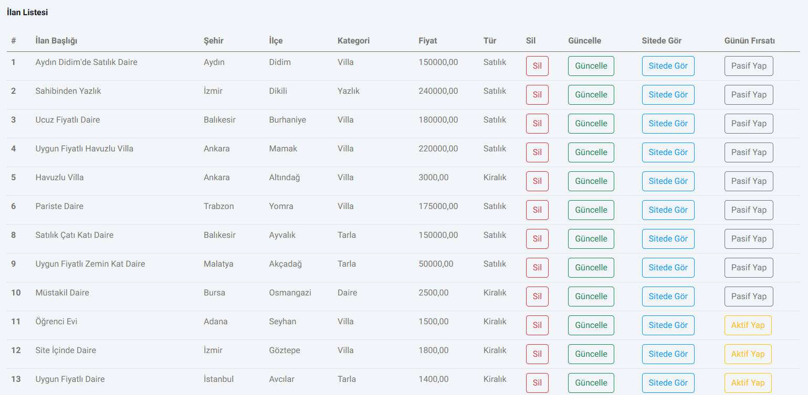

# Real Estate Dapper-Api Project

### This is a estate agent site. Users can make a search for the adverts they want or review all adverts. Bootstrap and Javascript technologies were used on the frontend and Dapper, API, MVC and Csharp technologies were used on the backend.

## Features

- Estate Agent Login Panel : Agent can login his panel and review statistics or delete their adverts.

- Admin Panel : Admin can manage categories, personels,adverts,statistics,services and locations.

- Searching : Users make a search for the adverts.

## Technologies
- Asp.Net Core
- Dapper
- SignalR
- API
- Mvc
- CSharp
- JWT(Json Web Token)
- MSSQL
- Swagger
- Trigger

## Site Images 

## Admin and EstateAgent Panel Images

